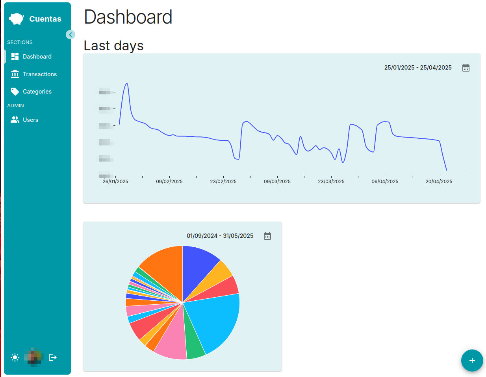

# 💰 Bank Account Tracker

A full-stack app (backend + frontend) to keep track of your bank account with precision. Simple, fast, and designed so you never lose sight of a single cent.



## 🧱 Tech Stack

- **Frontend**: [React](https://reactjs.org/), bootstrapped with [bcboilerplates](https://bcboilerplates.com/)
- **Backend**: [NestJS](https://nestjs.com/), also generated via [bcboilerplates](https://bcboilerplates.com/)
- **Database**: (Add your DB here, e.g. PostgreSQL, SQLite…)

## ✨ Features

- 📅 Import CSV files from your bank
- 🏷️ Edit and manage transaction categories
- 📊 Small dashboard with insights and totals

## 📦 Getting Started

Clone the repo and install dependencies:

```bash
git clone https://github.com/your-username/your-repo-name.git
cd your-repo-name
```

### Frontend

```bash
cd client
npm install
npm run dev
```

### Backend

```bash
cd server
npm install
npm run start:dev
```

## 📁 Project Structure

```
/
├── client/       # React frontend
├── server/       # NestJS backend
└── README.md
```

## 🛠️ Todo

- Export reports
- Add more charts and filters
- Tests

---

Made with ❤️ and spreadsheets that got out of hand.

